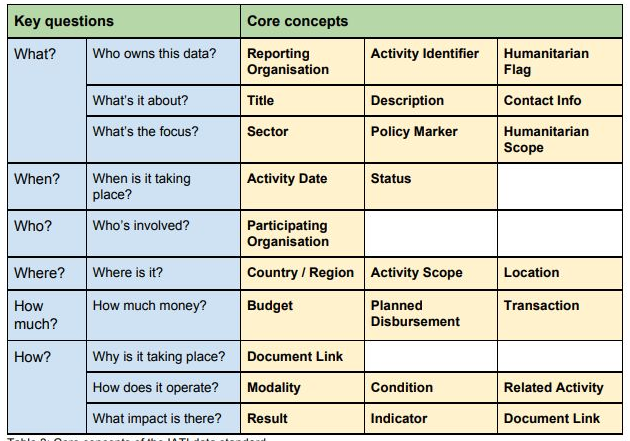

# iati

## Objective

A data package with UNHCR contribution to the International Aid Transparency Initiative (IATI) that aims at:

 * reshaping IATI extraction from a complex xml file structure to a more user-friendly tabular format with necessary look-up code tables
 * offer easy to consume documentation on the data structure
 * provide built-in ggplot2 visualization, aka a "__chart library__" around high level key questions on UNHCR programme. Those visualizations can be integrated in Operation Situation Analysis or Protection Monitoring Analysis.

## Context 

UNHCR is committed to IATI: [https://reporting.unhcr.org/iati](https://reporting.unhcr.org/iati)

Extracting information from IATI can assist governments to plan and manage their budgets; parliamentarians and citizens to better hold governments accountable; community-based organisations to influence how resources are used; and journalists, researchers and activists to investigate the use and impact of the resources.

Information from Global Focus is translated monthly into the IATI open data standard and published using UNHCR’s IATI identifier: XM-DAC-41121. An overview of the publication process is accessible through [IATI Dashboard](http://dashboard.iatistandard.org/publisher/unhcr.html). Every UNHCR operation world-wide is reported on for each year from 2016. This includes financial information (budget, contributions, disbursements and expenditure), office locations, and results at various levels of activity. Activities for 2019 and onwards are be published as soon as possible after they become available. This current package is updated a much as possible.... 

## What is IATI?

Launched in Accra in 2008, the International Aid Transparency Initiative ([IATI](https://iatistandard.org/en/about/)) is a multi-stakeholder initiative and international open data standard that aims to improve the transparency and openness of both development and humanitarian activities. In the 2016 Humanitarian grand Bargain, multiple organisations also [committed to](https://interagencystandingcommittee.org/greater-transparency) "_Publish timely, transparent, harmonised and open high-quality data on humanitarian funding within two years of the World Humanitarian Summit in Istanbul” noting that parties “consider IATI to provide a basis for the purpose of a common standard._"

IATI provides a mechanism for the regular, automated publication of open data on financial flows and also enables organizations to publish information on their project or programming activities, including information on monitoring, evaluation and results. Overall, 1000+ [humanitarian and development organisations](https://www.iatiregistry.org/publisher/unhcr), including government donors, multilateral and UN agencies and international and local NGOs currently use the IATI Standard to publish information on who funds them, where the money goes and the impact or outcome of their activities. The use of IATI for Humanitarian actors is among the commitment from the grand bargain as presented in the  [dedicated portal](https://www.humportal.org/about).

The International Aid Transparency Initiative (IATI) data to trace aid flows from donor treasuries to their final end use. IATI is designed so that people can trace development spending flows through the development implementation chain, from one organization to other organizations, right down to the final stage in the chain: spending on goods and services.  __Traceability__ in IATI works by following the money as it flows from organization to organization through the development implementation chain. Provided that all organizations publish their information, it is possible to assess how much of the total funding at the beginning of the implementation chain is spent on goods and services, and where the money is spent. 

Data published to IATI is published in `activity` units, the core building blocks of the data. __Activities__ are usually projects, but they can be any unit of development cooperation as defined by the publisher, such as a program or a contract. Typically,an entire donor country program is made up of a number of activities. Each activity is given a unique identifier and contains details of all incoming and outgoing transactions. Each transaction also has a unique identifier and contains data covering,among other things,the date, the value, a description, and details about the provider and receivers of the funds. It is classified into one of three categories.

__Disbursement__: Outgoing funds placed at the disposal of a recipient government or organization, or funds transferred between two separately reported activities. Under IATI traceability standards the recipient of a disbursement should also be required to report their activities to IATI.

__Expenditure__: Outgoing funds spent directly on goods and services for the activity. The recipients of expenditures fall outside of IATI traceability standards and are considered to be the end of the implementation chain. Therefore, an expenditure provided to a non-country-based organization is considered to be funds `not reaching the country.

__Incoming fund__: Funds received for an activity, which can be from an external or internal source.

__Organisations__ can have different roles in IATI (each of them being segregated into different "Organisation Types"):
 * Reporting Organisations, i.e. organisations voluntarily reporting about their aid projects
 * Implementations organisations, that actually implements the activity.
 
The main concept are nicely summarised in the table below from [IFRC IATI Feasibility Study](https://media.ifrc.org/ifrc/wp-content/uploads/sites/5/2018/03/IFRC-IATI-Feasibility-Study-Report-Final-2017-12-14.pdf) - see also the [Appendices](https://media.ifrc.org/ifrc/wp-content/uploads/sites/5/2018/03/IFRC-IATI-Feasibility-Study-Appendices-Final-2017-12-14.pdf)

 

## Key Visualisation in the library

 *  Comparison of UNHCR budget and expenditure.
 *  Comparison of UNHCR budget and expenditure weighted by # PoCs / GPP in the country.
 *  Expenditure and its evolution per sector, impact /outcome area
 *  Comparison of funds received by different UN Agencies (UNICEF, WFP, IOM, UNDP, UNOCHA)
 *  Comparison showing resources devoted by donors to different humanitarian crisis.
 *  Comparison showing donors’ humanitarian budget vs development budget devoted to displacement crisis by key donors/region
 * Comparison showing how much of donors funding goes to migratory / refugee issues
 * Evolution of indicators against thresholds
 
## Country Factsheet

All the key visualizations are easily created for any single country through a dedicated template for country fact sheet generated a slide deck ready for data interpretation and inclusion in existing Situation analysis for program design or Protection Monitoring Analysis for advocacy.

## Install  

``` 
# With {remotes} using GitHub API
# install.packages("remotes")
remotes::install_github("unhcr-americas/iati")
```

## Contribute

This package is built with the help of [fusen package](https://thinkr-open.github.io/fusen/index.html) which allow to easily maintain consistent documentation through a single notebook. 

``` 
fusen::inflate(flat_file = "dev/flat_full.Rmd", vignette_name = "Get started")
```


